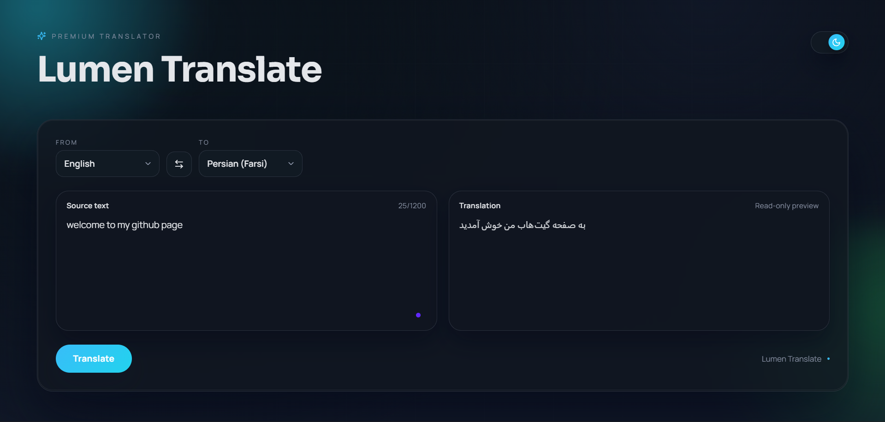
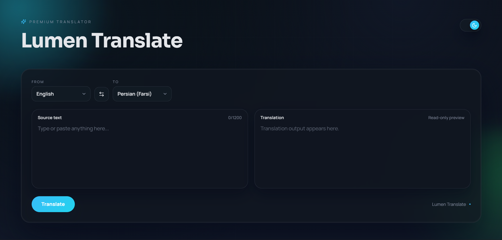
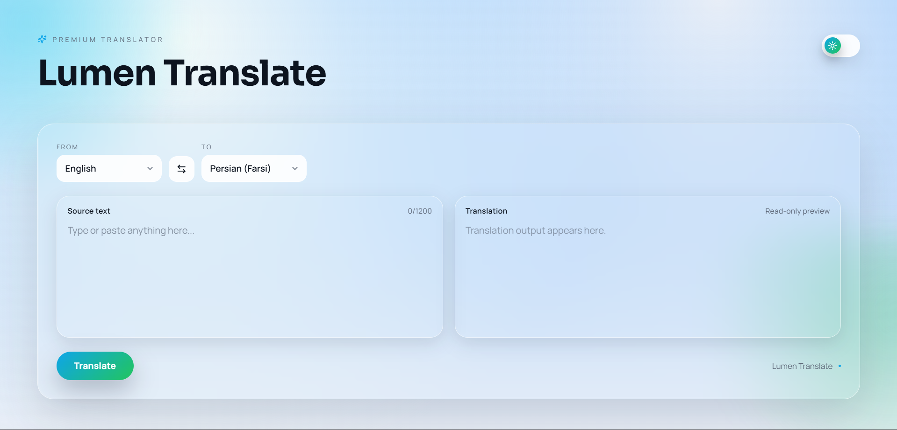

# 🌟 Lumen Translate

## **Lumen Translate** is a premium, modern web translator built with **React**. It offers a sleek UI, smooth animations, and support for multiple languages with live translation functionality. Designed with both **light and dark themes**, Lumen Translate brings a polished, responsive, and enjoyable translation experience to your browser.

## 🔗 Live Preview

👉 **View Live Demo:**  
https://lumentranslate.netlify.app/

---





---

## Features

- **Beautiful UI** with glassmorphism panels and blurred orbs.
- **Dark & Light Mode** with smooth theme transitions.
- **Multi-language support** with live language detection.
- **Swap languages** functionality.
- **Responsive design** for desktop and mobile.
- **Animated interactions** powered by Framer Motion.

---

## Tech Stack

- **React 19**
- **Framer Motion** for animations
- **Lucide React** for icons

---

## Installation

```bash
git clone https://github.com/yourusername/lumen-translate.git
cd lumen-translate
npm install
npm start
```
